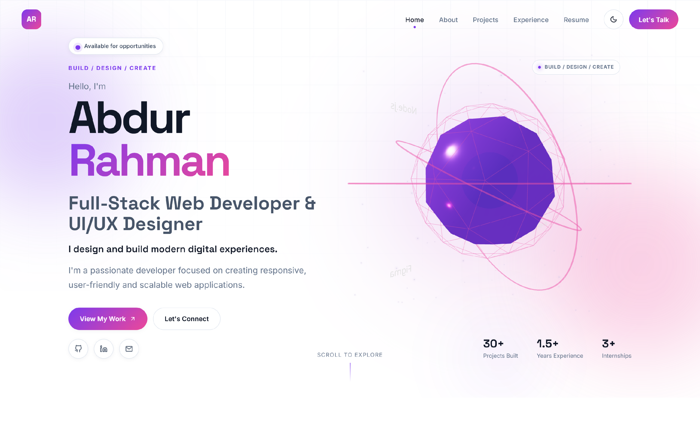
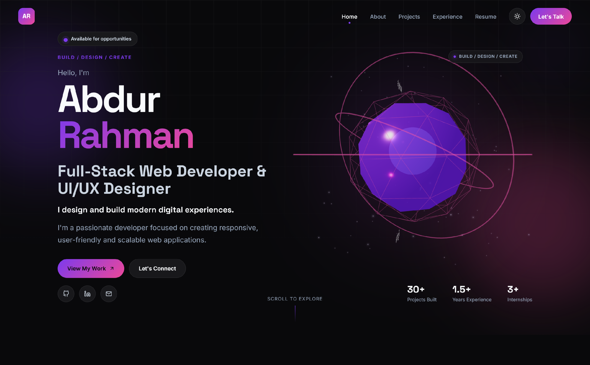
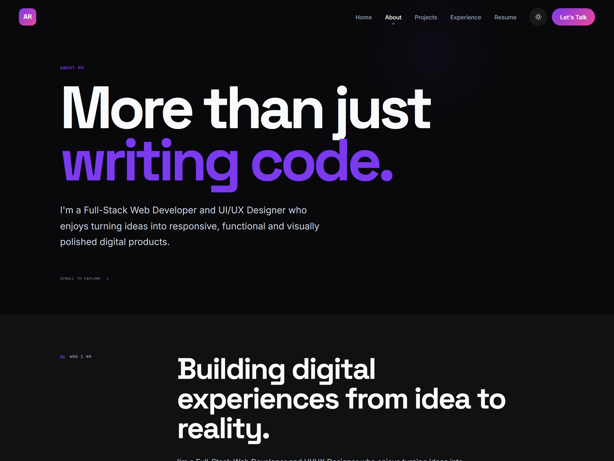
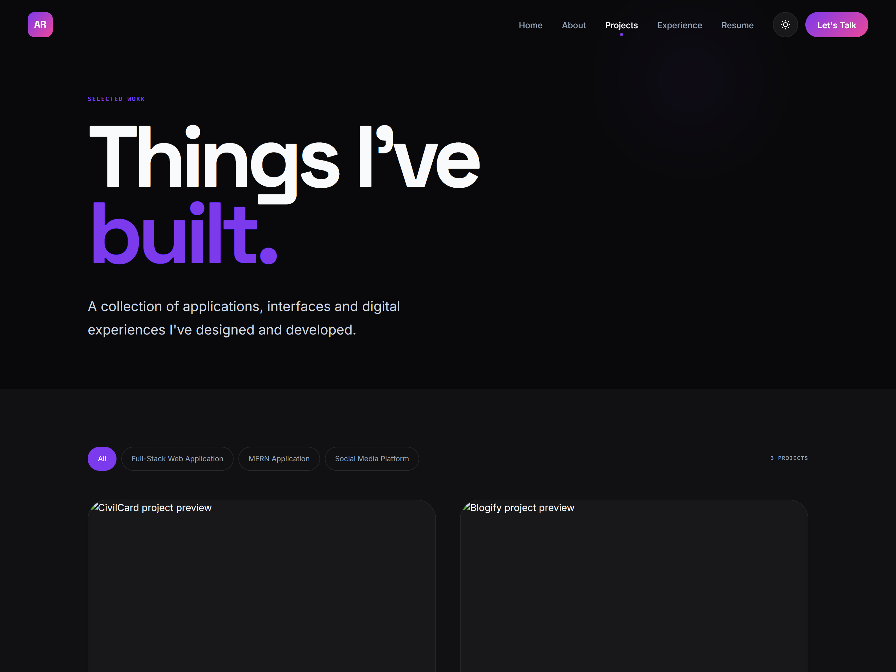
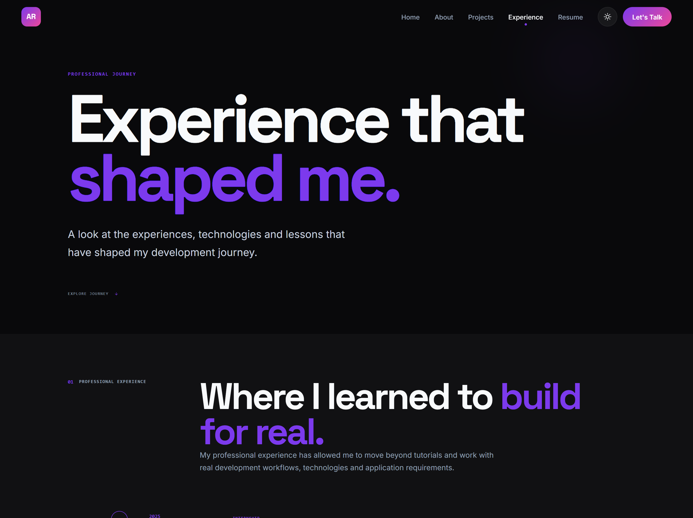
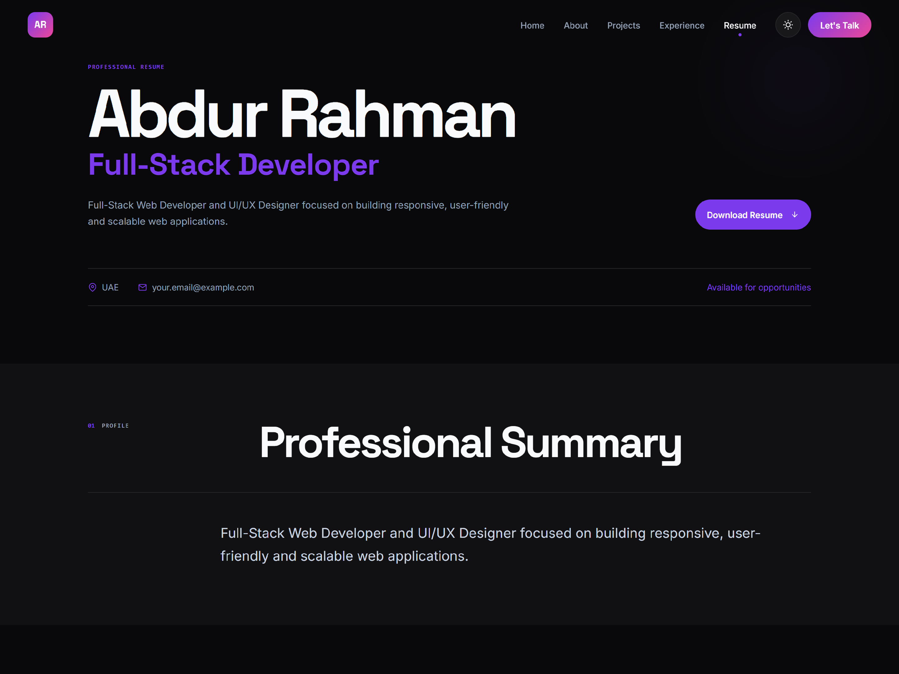
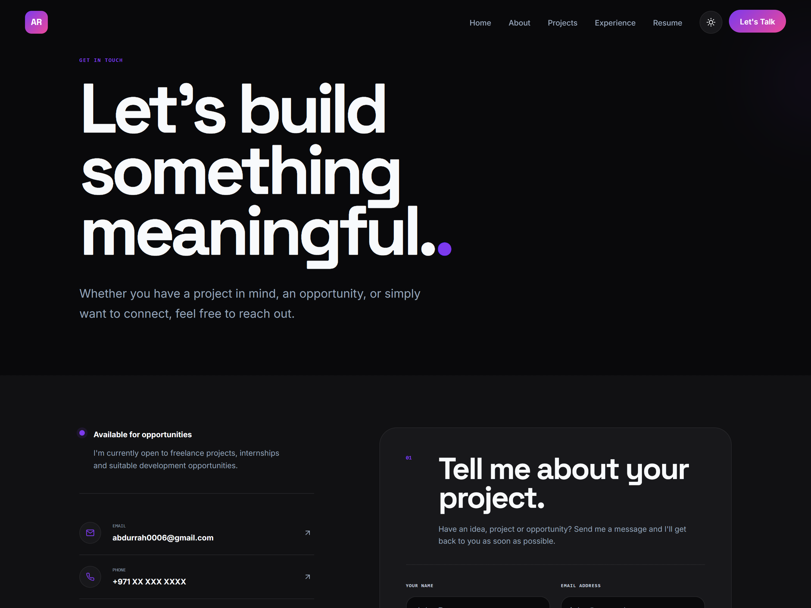

# 👨‍💻 Personal Portfolio — Full-Stack Web Developer & UI/UX Designer

A modern, responsive, and interactive personal portfolio website built to showcase my **professional profile, technical skills, projects, experience, and design capabilities**.

The portfolio is designed as both a personal brand website and a professional platform for connecting with **recruiters, clients, companies, and potential collaborators**.

It combines modern frontend development, responsive UI/UX design, animations, interactive project presentations, 3D visuals, and a theme-based design system to create a polished digital representation of my work.

---

## 🖼️ Website Preview

### 🏠 Home / HeroLight



### 🏠 Home / HeroDark



The homepage introduces my professional profile through a modern hero section featuring animated UI elements, interactive 3D visuals, technology highlights, and clear calls to action.

---

### 👨‍💻 About



The About section presents my background, development approach, technical strengths, and professional profile.

---

### 🚀 Projects



The Projects section showcases selected development work with project previews, technologies, categories, and links to detailed case studies.

---

### 💼 Experience



The Experience section presents my internships, professional experience, responsibilities, and development journey.

---

### 📄 Resume



The Resume section provides a structured overview of my education, experience, skills, and professional background.

---

### 📬 Contact



The Contact page provides multiple ways to get in touch, including email, phone, WhatsApp, social profiles, and the contact form.

---

## ✨ Features

### 🏠 Professional Homepage

The homepage acts as the primary introduction to my professional profile.

It includes:

* Professional introduction
* Full-Stack Developer & UI/UX Designer positioning
* Personal tagline
* Short professional description
* Call-to-action buttons
* Technology highlights
* Professional statistics
* Interactive visual/3D hero section
* Smooth animations
* Responsive layout

The Hero section is designed to immediately communicate:

* Who I am
* What I do
* What technologies I work with
* What I build
* How visitors can explore my work

---

### 👨‍💻 About Me

A dedicated section/page describing my professional background, development approach, and interests.

It includes:

* Professional introduction
* Development philosophy
* Technical strengths
* UI/UX capabilities
* Full-stack development experience
* Problem-solving approach
* Personal highlights

The section is designed to give recruiters and clients more context beyond the project showcase.

---

### 🚀 Projects Showcase

The portfolio includes a dedicated project showcase for presenting my development work.

Projects can be categorized and presented with:

* Project title
* Project category
* Year
* Role
* Project preview
* Description
* Technologies used
* Project status
* Live website
* GitHub repository
* Featured projects

Projects are stored in centralized data files so that new projects can be added without restructuring the UI.

---

### 📖 Project Details

Each project can have its own detailed project page.

Instead of only displaying a project card, the project details page explains the complete development process.

It can include:

* Project overview
* Problem statement
* Proposed solution
* Development process
* Main features
* Technologies
* Challenges
* Solutions
* Key learnings
* Screenshots
* Live project
* GitHub repository

This allows visitors to understand not only **what was built**, but also **how and why it was built**.

---

### 💼 Experience

A dedicated experience section for presenting professional development experience.

It can include:

* Internships
* Freelance experience
* Development roles
* Responsibilities
* Technologies used
* Projects worked on
* Key achievements
* Professional timeline

The section is structured so additional experience can be added through centralized data.

---

### 📄 Resume

A dedicated resume section/page allowing visitors to learn more about my professional background.

Features include:

* Resume preview
* Professional summary
* Education
* Technical skills
* Experience
* Projects
* Downloadable resume

A downloadable PDF resume is provided for recruiters and hiring managers.

---

### 📬 Contact

The portfolio includes a dedicated contact page for professional inquiries.

Visitors can contact me regarding:

* Freelance projects
* Full-time opportunities
* Internships
* Collaboration
* Web development
* UI/UX projects
* General professional inquiries

The contact section includes:

* Email
* Phone
* WhatsApp
* Location
* GitHub
* LinkedIn
* Contact form

The contact form is structured so it can be connected to a backend/email service for production message handling.

---

### 🎨 Theme System

The portfolio includes a customizable theme system.

Available themes include:

* Purple
* Blue
* Rose
* Dark

The theme system is implemented using CSS custom properties and allows the visual appearance of the website to change dynamically.

Theme preferences are persisted using browser local storage.

---

### 🌗 Dark Mode

A dedicated dark theme is included for users who prefer a darker interface.

The dark theme changes:

* Background colors
* Surface colors
* Text colors
* Borders
* Gradients
* Component appearance

The existing design system automatically adapts components to the selected theme through CSS variables.

---

### 🎨 Design System

The website uses a centralized design system based on CSS variables.

The system includes:

* Primary colors
* Secondary colors
* Accent colors
* Background colors
* Surface colors
* Text colors
* Border colors
* Gradients
* Typography
* Spacing
* Border radius
* Shadows
* Transitions
* Z-index layers

This keeps the visual language consistent throughout the website.

---

### 🧊 3D Hero Experience

The homepage includes an interactive 3D visual experience designed to make the portfolio more distinctive.

The Hero visual uses:

* Three.js
* React Three Fiber
* Drei
* 3D geometry
* Lighting
* Floating elements
* Technology labels
* Motion
* Theme-aware visual effects

The 3D experience is designed to support the professional content rather than distract from it.

---

### 🎞️ Animations & Motion

Framer Motion is used throughout the portfolio to create subtle and meaningful interactions.

Animations include:

* Page transitions
* Hero animations
* Section reveals
* Hover interactions
* Project interactions
* Button animations
* Scroll-based animations
* Form feedback
* Visual transitions

Animations are designed to enhance the experience while maintaining usability.

---

### 📱 Responsive Design

The portfolio is designed for multiple screen sizes.

Supported layouts include:

* Desktop
* Laptop
* Tablet
* Mobile

The interface adapts:

* Navigation
* Hero layout
* Project grids
* Typography
* Forms
* 3D visualizations
* Cards
* Spacing
* Buttons

The goal is to provide a consistent experience regardless of device.

---

### 🧭 Navigation

The portfolio uses React Router for client-side navigation.

Main sections include:

* Home
* About
* Projects
* Experience
* Resume
* Contact

Individual project pages are also accessible through dynamic routes.

---

### 🔝 Scroll To Top

A global scroll-to-top system is included through the main application layout.

When navigating between pages, the website automatically returns the visitor to the top of the new page.

---

### ❌ Custom 404 Page

A dedicated Not Found page is included for invalid routes.

Instead of displaying a generic browser error, users receive a branded portfolio experience with navigation back to the main website.

---

### 🦶 Professional Footer

The global footer provides quick access to:

* Navigation
* Social links
* Contact information
* Copyright information
* Professional branding

The footer is shared across the website through the main layout.

---

## 🛠️ Tech Stack

### Frontend

* React.js
* JavaScript
* React Router DOM
* CSS
* CSS Custom Properties
* Framer Motion
* React Icons

### 3D & Interactive Visuals

* Three.js
* React Three Fiber
* React Three Drei

### Development Tools

* Vite
* npm
* Git
* GitHub
* VS Code

---

## 🏗️ Architecture

The application follows a modular React architecture.

The website separates:

* Pages
* Reusable components
* Layout components
* Data
* Context/state management
* 3D components
* Page-specific styling

This makes the portfolio easier to maintain and expand as my professional profile and project collection grow.

---

## 📂 Project Structure

```Folder
portfolio/
│
├── public/
│   ├── images/
│   │   ├── profile.jpg
│   │   └── projects/
│   │       ├── civilcard/
│   │       ├── blogify/
│   │       └── petconnect/
│   │
│   └── resume/
│       └── resume.pdf
│
├── src/
│   │
│   ├── components/
│   │   │
│   │   ├── common/
│   │   │   ├── ThemeToggle/
│   │   │   ├── SectionTitle/
│   │   │   ├── ScrollToTOp/
│   │   │   ├── CursorGlow/
│   │   │   └── Button/
│   │   │
│   │   ├── layout/
│   │   │   ├── MainLayout/
│   │   │   ├── Footer/
│   │   │   └── Navbar/
│   │   │
│   │   └── 3D/
│   │   │   ├── DeveloperOrb/
│   │   │   ├── FloatingTech/
│   │   │   └── HeroScene/
│   │   │
│   │   └── 3D/
│   │       ├── Hero/
│   │       ├── AboutPreview/
│   │       ├── ContactCTA/
│   │       ├── SkillsPreview/
│   │       ├── ProjectsPreview/
│   │       └── JourneyPreview/
│   │
│   ├── context/
│   │   └── ThemeContext.jsx
│   │
│   ├── data/
│   │   ├── profileData.js
│   │   ├── navigationData.js
│   │   ├── projectsData.js
│   │   ├── contactData.js
│   │   ├── experienceData.js
│   │   ├── skillsData.js
│   │   └── themeData.js
│   │
│   ├── pages/
│   │   │
│   │   ├── Home/
│   │   │   ├── Home.jsx
│   │   │   └── Home.css
│   │   │
│   │   ├── About/
│   │   │   ├── About.jsx
│   │   │   └── About.css
│   │   │
│   │   ├── Projects/
│   │   │   ├── Projects.jsx
│   │   │   └── Projects.css
│   │   │
│   │   ├── ProjectDetails/
│   │   │   ├── ProjectDetails.jsx
│   │   │   └── ProjectDetails.css
│   │   │
│   │   ├── Experience/
│   │   │   ├── Experience.jsx
│   │   │   └── Experience.css
│   │   │
│   │   ├── Resume/
│   │   │   ├── Resume.jsx
│   │   │   └── Resume.css
│   │   │
│   │   ├── Contact/
│   │   │   ├── Contact.jsx
│   │   │   └── Contact.css
│   │   │
│   │   └── NotFound/
│   │       ├── NotFound.jsx
│   │       └── NotFound.css
│   │
│   ├── styles/
│   │   ├── animation.css
│   │   ├── global.css
│   │   ├── themes.css
│   │   └── variables.css
│   │
│   ├── App.jsx
│   └── main.jsx
│
├── .gitignore
├── index.html
├── package.json
├── package-lock.json
├── vite.config.js
└── README.md

```

> The exact structure may vary slightly depending on the final implementation. The application follows a modular component-based architecture with centralized data and page-specific styling.

---

## 🗃️ Centralized Data Architecture

Portfolio content is separated from UI components wherever possible.

For example:

```Str
src/data/
│
├── profileData.js
├── navigationData.js
├── projectData.js
├── contactData.js
└── themeData.js
```

This allows information to be updated without rewriting the components that display it.

For example, adding a new project can be done through the project data structure rather than manually creating another project component.

---

## 📊 Project Data Structure

Projects contain information such as:

```js
{
  id: "civilcard",
  title: "CivilCard",
  category: "Full-Stack Web Application",
  year: "2025",
  role: "Full-Stack Developer",
  image: "/images/projects/civilcard.jpg",


  preview: {
    description: "Project description..."
  },


  overview: {
    title: "Project overview",
    description: "Detailed project overview..."
  },


  problem: {
    title: "The Problem",
    description: "Problem being solved..."
  },


  solution: {
    title: "The Solution",
    description: "Implemented solution..."
  },


  development: {
    title: "Development Process",
    description: "Development approach..."
  },


  features: [],
  technologies: [],
  challenges: [],
  learnings: [],
  screenshots: [],


  links: {
    live: "#",
    github: "#"
  },


  featured: true
}
```

This structure allows project preview cards and detailed project pages to use the same source of information.

---

## 🎨 Theme Architecture

The website uses CSS custom properties as the foundation of its theme system.

The default theme is:
```text
Purple
```

Additional themes include:
```text
Blue
Rose
Dark
```
Themes are applied using the data-theme attribute:

```text
<html data-theme="purple">
```
The theme context manages:

* Current theme
* Theme switching
* Theme persistence
* Available themes

The selected theme is stored locally in the browser so the preference remains after refreshing the website.

---

## 🧭 Application Flow
```flow
Visitor
   │
   ▼
Homepage
   │
   ├── About
   │
   ├── Projects
   │      │
   │      └── Project Details
   │
   ├── Experience
   │
   ├── Resume
   │
   └── Contact
          │
          └── Contact Form
```
---

## 🔄 Project Exploration Flow
```flow
Projects Page
      │
      ▼
Project Preview
      │
      ▼
View Project
      │
      ▼
Project Details
      │
      ├── Overview
      ├── Problem
      ├── Solution
      ├── Development
      ├── Features
      ├── Technologies
      ├── Challenges
      ├── Learnings
      ├── Screenshots
      │
      └── Live / GitHub
```
---

## 📬 Contact Form

The contact form currently provides a structured interface for collecting:
```text
Name
Email
Subject
Message
```

The frontend handles:

* Form state
* Input changes
* Validation
* Submission state
* Success feedback
* Form reset

The application architecture allows the form to be connected to a backend API or email service when required.

---

## 🔐 Security

The portfolio is primarily a frontend application, so no sensitive credentials or private API keys should be stored in the repository.

Environment-specific configuration should be kept outside version control.

```
.env
```

is excluded through ``` .gitignore ``` where required.

## 🚀 Installation

### Prerequisites

Make sure you have installed:

* Node.js
* npm
* Git

--- 

### 1. Clone the Repository
```bash
git clone https://github.com/abdurrah0006/portfolio.git
cd portfolio
```

### 2. Install Dependencies
```bash
npm install
```
3. Start the Development Server
```bash
npm run dev
```
The Vite development server will provide a local URL, typically: 

```
http://localhost:5173
```

### 4. Build for Production
```
npm run build
```

### 5. Preview the Production Build
```
npm run preview
```

---

## 🌐 Deployment

The portfolio is built as a production-ready React/Vite application and can be deployed using modern frontend hosting platforms.

The production deployment should include:

* HTTPS
* Custom domain
* Optimized production build
* Correct SPA routing configuration
* Optimized assets
* Responsive design
* SEO metadata
* Social sharing metadata

The live deployment represents my official professional portfolio.

---

## 🔍 SEO & Professional Optimization

The portfolio is structured with professional discoverability in mind.

Optimization includes:

* Descriptive page titles
* Meta descriptions
* Semantic HTML
* Proper heading hierarchy
* Descriptive image alt text
* Responsive design
* Fast-loading assets
* Clean URLs
* Project-specific pages
* Social sharing metadata
* Search-engine-friendly content

The goal is to make the portfolio useful not only as a visual showcase but also as a professional online presence.

---

## ⚡ Performance

Performance considerations include:

* Vite production builds
* Component-based architecture
* Optimized assets
* Responsive images
* Reusable components
* Controlled animations
* Lazy loading where appropriate
* Responsive 3D rendering
* Minimal unnecessary dependencies

3D elements are designed to enhance the experience while keeping the website usable across different devices.

---

## 📱 Responsive Experience

The website has been designed with a mobile-first mindset and tested across different viewport sizes.

```
Desktop
   ↓
Laptop
   ↓
Tablet
   ↓
Mobile

```

Important UI components such as navigation, project cards, forms, typography, hero sections, and 3D visuals adapt according to screen size.

---

## 🧠 What I Learned

Building my portfolio as a real production project helped strengthen my understanding of:

* React application architecture
* Component-driven development
* React Router
* State management
* Context API
* CSS architecture
* Responsive web design
* Design systems
* CSS custom properties
* Theme systems
* Framer Motion
* Three.js
* React Three Fiber
* Interactive UI development
* Data-driven components
* Project presentation
* UX-focused development
* Performance optimization
* SEO fundamentals
* Production deployment

More importantly, the project helped me approach a website not only as a collection of components, but as a complete digital product and professional brand experience.

---

## 🔮 Future Improvements

Potential future improvements include:

* CMS-based portfolio management
* Admin dashboard for managing projects
* Backend-powered contact form
* Email notifications
* Blog platform
* Case study management
* More advanced 3D interactions
* Interactive resume
* GitHub API integration
* GitHub project statistics
* Automated project synchronization
* Testimonials management
* Analytics dashboard
* Multi-language support
* Advanced accessibility improvements
* Progressive Web App features

--- 

## 👨‍💻 About Me

I'm a Full-Stack Web Developer and UI/UX Designer focused on building modern, responsive, and user-friendly digital experiences.

My work combines:

```
Design
   +
Frontend Development
   +
Backend Development
   +
User Experience
```

I enjoy taking an idea from concept and interface design through development and deployment.

---

## 📫 Connect With Me

Portfolio: https://abdurrah0006.com

GitHub: https://github.com/abdurrah0006

LinkedIn: https://linkedin.com/in/abdurrah0006

Email: abdurrah0006@gmail.com

---

## ⭐ Support

If you found this project interesting, feel free to explore the source code, check out the projects, or connect with me.

If you like the portfolio, consider giving the repository a ⭐.

---

## 📄 License

This project is a personal portfolio website.

The source code is available for learning and reference purposes. Portfolio content, personal information, branding, images, project assets, and resume materials may not be reused without permission.

---
